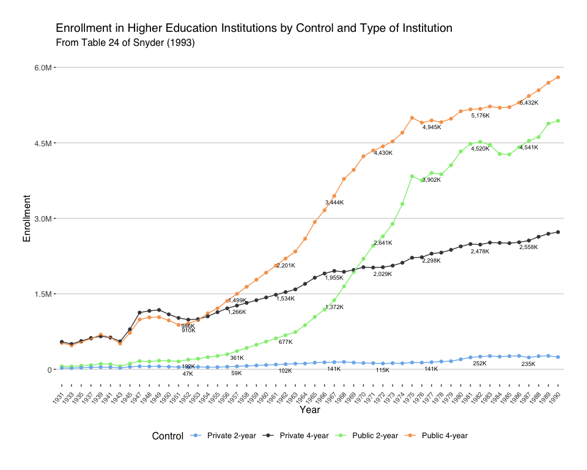
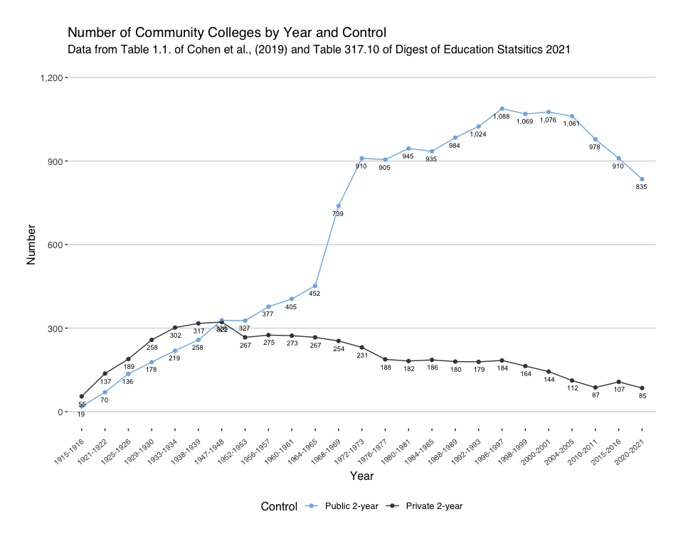
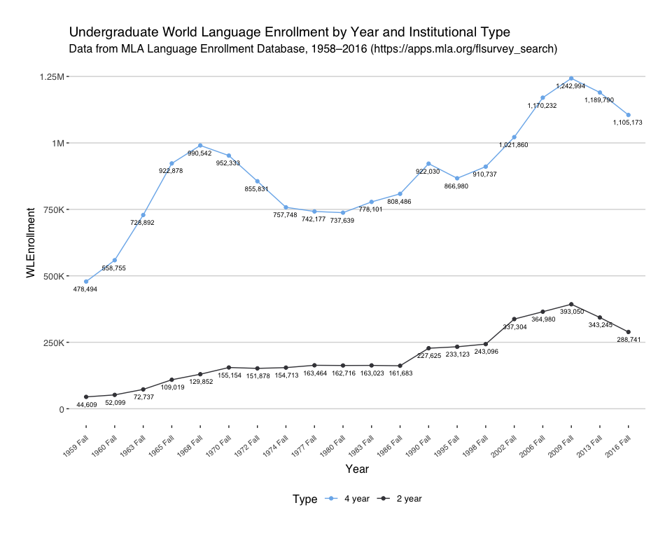
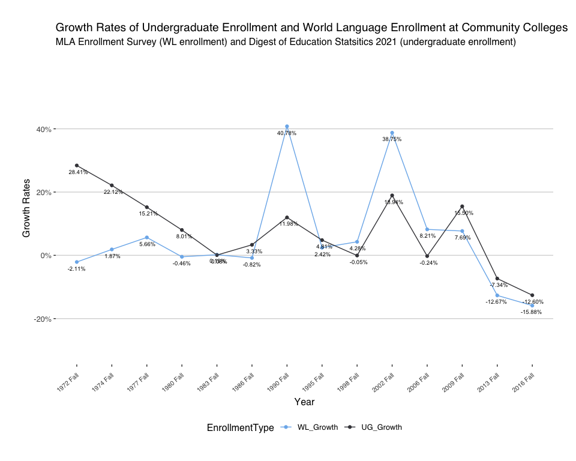
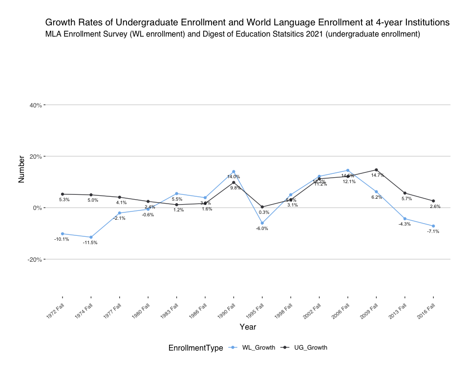

RProcedureLanguageProgramVitality2021
================
Tomonori Nagano
2023-10-03

# LanguageProgramVitality2023

R script for the data analysis in the following book chapter.

- Nagano, T. (2023). World Language Enrollment at Community Colleges in
  the U.S. between 1960 and 2010. In E. H. Uebel, F. Kronenberg, & S.
  Sterling (Eds.), Language Program Vitality in the United States: From
  Surviving to Thriving in Higher Education. (pp. xx-xx). Springer.
  (<https://link.springer.com/book/9783031436536>)

## Data sources

The enrollment data have been collected from the following sources:

- Cohen, Arthur M., Brawer, Florence B., & Kisker, Carrie, B. (2013).
  The American Community College (6th). San Francisco, CA: Jossey-Bass.
  - Table 1.1 “Numbers of Public and Private Nonprofit Two-Year
    Colleges, 1915–2011” (page 16). The data set is available in the
    data directory as a csv file.
- de Brey, C., Snyder, T. D., Zhang, A., & Dillow, S. A. (2021). Digest
  of Education Statistics 2021. National Center for Education Statistics
  / American Institutes for Research, U.S. Department of Education.
  - Table 303.70. “Total undergraduate fall enrollment in
    degree-granting postsecondary institutions, by attendance status,
    sex of student, and control and level of institution: Selected
    years, 1970 through 2030”. The data set is available in the data
    directory as a csv file.
- MLA’s Language Enrollment Database, 1958-2016
  (<http://apps.mla.org/flsurvey_search>)
  - “MLA_Historical_enrollments_1958-2016\_(3-13-19).xlsx” was
    downloaded from the MLA’s website. Apparently, the MLA no longer
    makes the full dataset available on their website as of August 2023.
    Therefore, no dataset is available on this repository. If you need
    this dataset, please e-mail <tnagano@lagcc.cuny.edu>.
- Snyder, Thomas D. (1993). 120 Years of American Education: A
  Statistical Portrait. Washington, D.C.: U.S. Department of Education.
  - Table 24 “Enrollment in institutions of higher education, by sex,
    attendance status, and type and control of institution: 1869–70 to
    fall 1991” (pp.76-77). The data set is available in the data
    directory as a csv file.

## preambles

The following packages and functions are used in this analysis.

``` r
# clear the cache
rm(list = ls())

library(ggplot2); library(gdata); library(xtable); library(ggthemes)
library(openxlsx); library(reshape); library(plyr)

#setwd("~/Desktop/")
setwd("~/Dropbox/Documents/USB/801AcademicJournals/LanguageProgramVitality2021/")

# change the default width
width.default <- getOption("width"); options(width=120)

# the add comma fonction
addComma<-function(x) {format(x, big.mark = ',', trim = TRUE, scientific = FALSE)}

# creating a notin function
`%notin%` <- Negate(`%in%`)
```

## Snyder (1993)

The following script analyze Snyder (1993)’s data.

``` r
# reading CSV data
Snyder = read.csv(file="data/Snyder1993e_Table24.csv",header=TRUE,sep=",")
# The data between 1957 and 1962 are missing in Snyder (1993) and have been extrapolated from the figures in 1956 and 1962.
Snyder$X1957 <- c(1499,361,1266,59)
Snyder$X1958 <- c(1640,424,1319,67)
Snyder$X1959 <- c(1780,487,1373,76)
Snyder$X1960 <- c(1920,551,1427,85)
Snyder$X1961 <- c(2060,614,1481,94)
Snyder$X1962 <- c(2201,677,1534,102)
Snyder$Year <- as.factor(Snyder$Year)
colnames(Snyder) <- sub("^X(\\d+)", "\\1", colnames(Snyder), perl=TRUE)
Snyder <- melt(Snyder,id=c("Year"))
colnames(Snyder) <- c("Control","Year","Enrollment")
Snyder$Control <- factor(Snyder$Control, levels=c("Public 4-year","Public 2-year", "Private 4-year", "Private 2-year"))
# fixing the order of Year level
Snyder <- drop.levels(Snyder)

summary(Snyder)
```

    ##            Control        Year       Enrollment    
    ##  Private 2-year:52   1931   :  4   Min.   :  23.0  
    ##  Private 4-year:52   1933   :  4   1st Qu.: 166.8  
    ##  Public 2-year :52   1935   :  4   Median :1038.5  
    ##  Public 4-year :52   1937   :  4   Mean   :1657.0  
    ##                      1939   :  4   3rd Qu.:2514.2  
    ##                      1941   :  4   Max.   :5803.0  
    ##                      (Other):184

``` r
# plotting
p <- ggplot(Snyder, aes(Year, Enrollment, group = Control)) + 
    geom_point(aes(color=Control)) + 
    geom_line(aes(color=Control)) + 
    geom_text(data=subset(Snyder, as.numeric(as.character(Snyder$Year))%%5==2 & as.numeric(as.character(Snyder$Year)) > 1950), 
        aes(label=paste(addComma(Enrollment),"K",sep="")), 
        position=position_dodge2(width=0.1, preserve="single", padding=5), vjust=2, size=2.5)

# using ggplot theme and modifying axis labels
p + theme_hc()+ scale_colour_hc() +
    theme(axis.text.x = element_text(angle = 50, vjust = 0.8, hjust=1, size=8)) +
    scale_y_continuous(name = "Enrollment", limits = c(0, 6000),
                     breaks = c(0, 1500, 3000, 4500, 6000), position = 'left',
                     labels = c('0', '1.5M', '3.0M', '4.5M', '6.0M')) +
    ggtitle("Enrollment in Higher Education Institutions by Control and Type of Institution",
        subtitle="From Table 24 of Snyder (1993)") +
    theme(plot.margin = unit(c(1,1,1,1), "cm"))
```



``` r
ggsave("LanguageProgramVitality2021FigEnrollmentRev2.pdf", width = 10, height = 6)
write.csv(Snyder, file= "data/ROutput_Snyder1993e_Table24.csv", row.names = TRUE)
```

# Analyzing Cohen et al. (2013)

The following script analyze Cohen et al. (2013)’s data.

``` r
# reading csv data
Cohen = read.csv(file="data/Cohen2013_Table1_1.csv",header=TRUE,sep=",")
colnames(Cohen) <- c("Year","Public 2-year","Private 2-year")
Cohen$Year <- as.factor(Cohen$Year)
Cohen <- melt(Cohen,id=c("Year"))
colnames(Cohen) <- c("Year","Control","Number")

summary(Cohen)
```

    ##         Year              Control       Number      
    ##  1915-1916: 2   Public 2-year :25   Min.   :  19.0  
    ##  1921-1922: 2   Private 2-year:25   1st Qu.: 179.2  
    ##  1925-1926: 2                       Median : 267.0  
    ##  1929-1930: 2                       Mean   : 423.5  
    ##  1933-1934: 2                       3rd Qu.: 811.0  
    ##  1938-1939: 2                       Max.   :1088.0  
    ##  (Other)  :38

``` r
# plotting
p <- ggplot(Cohen, aes(Year, Number, group = Control)) + 
    geom_point(aes(color=Control)) + 
    geom_line(aes(color=Control)) + 
    geom_text(aes(label=paste(addComma(Number),sep="")), 
        position=position_dodge2(width=0.1, preserve="single", padding=5), vjust=2, size=2.5)

# using ggplot theme and modifying axis labels
p + theme_hc()+ scale_colour_hc() +
    theme(axis.text.x = element_text(angle = 40, vjust = 0.8, hjust=1, size=8)) +
    scale_y_continuous(name = "Number", limits = c(0, 1200),
                     breaks = c(0, 300, 600, 900, 1200), position = 'left',
                     labels = c('0', '300', '600', '900', '1,200')) +
    ggtitle("Number of Community Colleges by Year and Control",
        subtitle="Data from Table 1.1. of Cohen et al., (2019) and Table 317.10 of Digest of Education Statsitics 2021") +
    theme(plot.margin = unit(c(1,1,1,1), "cm")) +
    theme(axis.title.x = element_text(margin=margin(t=10)))
```



``` r
ggsave("ROutput/LanguageProgramVitality2021FigNum2Year.pdf", width = 10, height = 6)
write.csv(Cohen, file= "ROutput/Cohen2013_Table1_1_summary.csv", row.names = TRUE)
```

# MLA Enrollment Survey

The following script analyze the MLA’s Enrollment Survey data.

``` r
# importing data
MLA <- read.csv("data/MLA_Historical_enrollments_1958-2016_(3-13-19).csv", sep = ",")
# filling empty "UNIV_NAME_HISTORY"
MLA[MLA$UNIV_NAME_HISTORY=="",c("UNIV_NAME_HISTORY")] <- MLA[MLA$UNIV_NAME_HISTORY=="",c("UNIV")]
MLA$SRVY_YEAR <- as.factor(MLA$SRVY_YEAR)
MLA$TERM <- as.factor(MLA$TERM)
MLA$YR.TERM <- as.factor(MLA$YR.TERM)
MLA$UNIV <- as.factor(MLA$UNIV)
MLA$UNIV_NAME_HISTORY <- as.factor(MLA$UNIV_NAME_HISTORY)
MLA$CAMPUS <- as.factor(MLA$CAMPUS)
MLA$STATE <- as.factor(MLA$STATE)
MLA$STATE_ID <- as.factor(MLA$STATE_ID)
MLA$MLA.ICLEVEL <- as.factor(MLA$MLA.ICLEVEL)
levels(MLA$MLA.ICLEVEL) = c("4 year","2 year")
MLA$LANG_CODE <- as.factor(MLA$LANG_CODE)
MLA$CITY <- as.factor(MLA$CITY)
MLA$LANGUAGE <- as.factor(MLA$LANGUAGE)
MLA$LANG_REGION <- as.factor(MLA$LANG_REGION)
MLA$OTHER_LANG <- as.factor(MLA$OTHER_LANG)
MLA$GEOGRAPHY_CODE <- as.factor(MLA$GEOGRAPHY_CODE)
MLA$N_RESP <- as.factor(MLA$N_RESP)
MLA$ZERO_ERL <- as.factor(MLA$ZERO_ERL)

# Between 1963 - 1972 many institutions did not report "UNDERGRAD_TOTAL" and "GRAD_TOTAL". We beed to use "ALL_LEVEL_TOTAL" instead
MLA[is.na(MLA$UNDERGRAD_TOTAL),c("UNDERGRAD_TOTAL")] <- MLA[is.na(MLA$UNDERGRAD_TOTAL),c("ALL_LEVEL_TOTAL")]

summary(MLA)
```

    ##     INST_ID          SRVY_YEAR          TERM               YR.TERM                                 UNIV       
    ##  Min.   :     80   2016   : 25974   Fall  :194887   2013 Fall  : 13498   U OF CALIFORNIA, BERKELEY   :   807  
    ##  1st Qu.:   2446   2013   : 13498   Summer: 13132   2009 Fall  : 13362   U OF CALIFORNIA, LOS ANGELES:   749  
    ##  Median :   3738   2009   : 13362                   2016 Fall  : 13030   COLUMBIA U (NY)             :   746  
    ##  Mean   :   5451   2006   : 12538                   2016 Summer: 12944   HARVARD U                   :   726  
    ##  3rd Qu.:   4884   2002   : 12271                   2006 Fall  : 12538   U OF WISCONSIN, MADISON     :   666  
    ##  Max.   :1004414   1990   : 10294                   2002 Fall  : 12271   U OF CHICAGO                :   663  
    ##  NA's   :5010      (Other):120082                   (Other)    :130376   (Other)                     :203662  
    ##          CAMPUS          NCES_ID      
    ##             :170900   Min.   :  1025  
    ##  Main       :   949   1st Qu.:147703  
    ##  Los Angeles:   903   Median :181394  
    ##  Berkeley   :   809   Mean   :190730  
    ##  Madison    :   692   3rd Qu.:213011  
    ##  Bloomington:   621   Max.   :990201  
    ##  (Other)    : 33145                   
    ##                                                                                                                    UNIV_NAME_HISTORY 
    ##  U OF CALIFORNIA, BERKELEY                                                                                                  :   807  
    ##  U OF CALIFORNIA, LOS ANGELES                                                                                               :   749  
    ##  COLUMBIA U (NY)                                                                                                            :   746  
    ##  Harvard U merged w/ Radcliffe C in 1999.                                                                                   :   726  
    ##  Indiana U (IN) renamed Indiana U, Bloomington in 1968; in 2009, Bloomington enrollments included East & Kokomo enrollments.:   671  
    ##  U OF WISCONSIN, MADISON                                                                                                    :   666  
    ##  (Other)                                                                                                                    :203654  
    ##            CITY           STATE_ID          STATE        MLA.ICLEVEL       LANG_CODE               LANGUAGE    
    ##  New York    :  3581   5      : 20530   CA     : 20530   4 year:163757   3      :42417   SPANISH       :42417  
    ##  Chicago     :  2569   33     : 19466   NY     : 19466   2 year: 44045   2      :38035   FRENCH        :38035  
    ##  Philadelphia:  2188   39     : 13376   PA     : 13376   NA's  :   217   4      :29097   GERMAN        :29097  
    ##  Los Angeles :  2033   14     :  9600   IL     :  9600                   6      :11773   RUSSIAN       :11773  
    ##  Washington  :  1997   44     :  9050   TX     :  9050                   8      :10948   GREEK, ANCIENT:10948  
    ##  Boston      :  1487   (Other):135563   MA     :  8873                   (Other):74687   ITALIAN       :10940  
    ##  (Other)     :194164   NA's   :   434   (Other):127124                   NA's   : 1062   (Other)       :64809  
    ##  UNDERGRAD_1_2     UNDERGRAD_3_4     UNDERGRAD_TOTAL     GRAD_TOTAL      ALL_LEVEL_TOTAL    LANG_REGION    
    ##  Min.   :   0.00   Min.   :   0.00   Min.   :    0.0   Min.   :   0.00   Min.   :    0.0   E      :162889  
    ##  1st Qu.:   9.00   1st Qu.:   0.00   1st Qu.:   15.0   1st Qu.:   0.00   1st Qu.:   15.0   AP     : 21686  
    ##  Median :  30.00   Median :   3.00   Median :   40.0   Median :   0.00   Median :   40.0   MEA    : 14587  
    ##  Mean   :  91.23   Mean   :  26.53   Mean   :  115.3   Mean   :   5.51   Mean   :  117.8   NSA    :  6208  
    ##  3rd Qu.:  86.00   3rd Qu.:  20.00   3rd Qu.:  111.0   3rd Qu.:   0.00   3rd Qu.:  113.0   X      :  1538  
    ##  Max.   :8138.00   Max.   :3060.00   Max.   :78398.0   Max.   :6074.00   Max.   :78398.0          :   624  
    ##  NA's   :150718    NA's   :168421    NA's   :6225      NA's   :107777    NA's   :6225      (Other):   487  
    ##     OTHER_LANG     GEOGRAPHY_CODE N_RESP      ZERO_ERL  
    ##          :205854   1   :55996       :207750    :204420  
    ##  SWAHILI :   706   2   :52651     NR:   269   Z:  3599  
    ##  PERSIAN :   433   3   :40941                           
    ##  TAGALOG :   211   4   :17537                           
    ##  OJIBWE  :   117   5   :10757                           
    ##  ROMANIAN:   117   6   :29703                           
    ##  (Other) :   581   NA's:  434

``` r
# extracting the aggregated enrollment data by type (2 vs. 4-year)
MLA.type <- as.data.frame(xtabs(UNDERGRAD_TOTAL ~ YR.TERM + MLA.ICLEVEL, data = MLA))
# removing years with anomal data
MLA.type <- MLA.type[MLA.type$YR.TERM %notin% c("1958 Fall", "1961 Fall", "1969 Summer","1971 Summer", "2016 Summer"),]
colnames(MLA.type) <- c("Year","Type","WLEnrollment")

# plotting
p <- ggplot(MLA.type, aes(Year, WLEnrollment, group = Type)) + 
    geom_point(aes(color=Type)) + 
    geom_line(aes(color=Type)) + 
    geom_text(aes(label=paste(addComma(WLEnrollment),sep="")), 
        position=position_dodge2(width=0.1, preserve="single", padding=5), vjust=2, size=2.5)

# using ggplot theme and modifying axis labels
p + theme_hc()+ scale_colour_hc() +
    theme(axis.text.x = element_text(angle = 40, vjust = 0.8, hjust=1, size=8)) +
    scale_y_continuous(name = "WLEnrollment", limits = c(0, 1250000),
                     breaks = c(0, 250000, 500000, 750000, 1000000, 1250000), position = 'left',
                     labels = c('0', '250K', '500K', '750K', '1M', "1.25M")) +
    ggtitle("Undergraduate World Language Enrollment by Year and Institutional Type",
        subtitle="Data from MLA Language Enrollment Database, 1958–2016 (https://apps.mla.org/flsurvey_search)") +
    theme(plot.margin = unit(c(1,1,1,1), "cm")) + 
    theme(axis.title.x = element_text(margin=margin(t=10)))
```



``` r
ggsave("ROutput/LanguageProgramVitality2021FigMLEnrollment.pdf", width = 10, height = 6)
write.csv(MLA.type, file= "ROutput/MLA_Historical_enrollments_1958-2016_(3-13-19)_summary.csv", row.names = TRUE)
```

# Analyzing MLA enrollment data with the DES Table 303-70

``` r
# reading CSV data
DES = read.csv(file="data/USEDDigestofEdStat_tabn303_70.csv",header=TRUE,sep=",")
DES <- melt(DES,id=c("Year"))
colnames(DES) <- c("Year","Classification","Enrollment")
DES[grep(".*4.year.*",as.character(DES$Classification)),"Type"] <- "4 year"
DES[grep(".*2.year.*",as.character(DES$Classification)),"Type"] <- "2 year"
DES[grep(".*private.for.profit",as.character(DES$Classification)),"Control"] <- "Private for-profit"
DES[grep(".*private.nonprofit",as.character(DES$Classification)),"Control"] <- "Private"
DES[grep(".*public",as.character(DES$Classification)),"Control"] <- "Public"
DES$Type <- as.factor(DES$Type)
DES$Year <- as.factor(DES$Year)
DES <- DES[!DES$Control=="Private for-profit",]
DES <- drop.levels(DES[,-which(names(DES) %in% c("Classification"))],reorder=FALSE)
levels(MLA.type$Year) <- gsub('(\\d+) (\\w+)','\\1',levels(MLA.type$Year))

summary(DES)
```

    ##       Year       Enrollment          Type      Control         
    ##  1970   :  4   Min.   :  30376   2 year:78   Length:156        
    ##  1975   :  4   1st Qu.:1680594   4 year:78   Class :character  
    ##  1980   :  4   Median :3628622               Mode  :character  
    ##  1985   :  4   Mean   :3397450                                 
    ##  1986   :  4   3rd Qu.:5401852                                 
    ##  1987   :  4   Max.   :7618489                                 
    ##  (Other):132   NA's   :4

``` r
DES2 <- aggregate(Enrollment ~ Type + Year, DES, sum)

thisData.e1 <- merge(MLA.type, DES2, by.x = c("Year","Type"), by.y = c("Year","Type"), all.x = TRUE, all.y = TRUE)
thisData.e2 <- cast(thisData.e1, Year ~ Type)
# matches only between 1996 to 2016
write.csv(thisData.e2, file= "ROutput/EnrollmentComparison1.csv", row.names = TRUE)
```

# Analyzing MLA enrollment data with other data

The following script analyze Snyder (1993)’s data.

``` r
# renaming the levels
levels(Cohen$Year) <- gsub('(\\d+)-(\\d+)','\\1',levels(Cohen$Year))
levels(MLA.type$Year) <- gsub('(\\d+) (Fall|Summer)','\\1',levels(MLA.type$Year))
colnames(MLA.type) <- c("Year","Type","ML Enrollment")

Snyder[grep(".*4-year",as.character(Snyder$Control)),"Type"] <- "4 year"
Snyder[grep(".*2-year",as.character(Snyder$Control)),"Type"] <- "2 year"
Snyder$Type <- as.factor(Snyder$Type)
levels(Snyder$Control) <- gsub('(\\w+) (\\d-year)','\\1',levels(Snyder$Control))
Snyder2 <- aggregate(Enrollment ~ Type + Year, Snyder, sum)

thisData.e3 <- merge(MLA.type, Snyder2, by.x = c("Year","Type"), by.y = c("Year","Type"), all.x = TRUE, all.y = TRUE)
# matches between only 1963 and 1990
thisData.e4 <- cast(thisData.e3, Year ~ Type)

write.csv(thisData.e4, file= "ROutput/EnrollmentComparison2.csv", row.names = TRUE)
```

# Analyzing MLA, Snyder, and DES data

- MLA 1960 was removed since there was no undergraduate enrollment data
- Snyder’s 4-year include graduate enrollment
- ML Enrollment (MLA)
- Undergraduate Enrollment (Snyder (between 1963 - 1990), DES
  (1995-2016))

``` r
# reading CSV data
thisData = read.csv(file="data/MLA_DES2021EnrollmentCombinedData.csv",header=TRUE,sep=",")
colnames(thisData) <- c("Year","Type","MLEnrollment","UndergraduateEnrollment")
thisData$Year <- as.factor(thisData$Year)
thisData$Type <- as.factor(thisData$Type)

# computing growth rates
thisData <- ddply(thisData, "Type", transform, WL_Growth=c(NA,exp(diff(log(MLEnrollment)))-1))
thisData <- ddply(thisData, "Type", transform, UG_Growth=c(NA,exp(diff(log(UndergraduateEnrollment)))-1))
thisData <- thisData[,names(thisData) %notin% c("MLEnrollment","UndergraduateEnrollment")]
thisData$WL_Growth <- thisData$WL_Growth*100
thisData$UG_Growth <- thisData$UG_Growth*100

thisData2 <- melt(thisData,id=c("Year","Type"))
colnames(thisData2) <- c("Year","Type","EnrollmentType","Growth")

# plotting
p <- ggplot(subset(thisData2,Type=="2 year" & Year %notin% c("1970 Fall")), aes(Year, Growth, group = EnrollmentType))+
    geom_point(aes(color=EnrollmentType)) + 
    geom_line(aes(color=EnrollmentType)) + 
    geom_text(aes(label=paste(format(Growth,digits = 1),"%",sep="")), 
        position=position_dodge2(width=0.1, preserve="single", padding=5), vjust=2, size=2.5)

# using ggplot theme and modifying axis labels
p + theme_hc()+ scale_colour_hc() +
    theme(axis.text.x = element_text(angle = 40, vjust = 0.8, hjust=1, size=8)) +
    scale_y_continuous(name = "Growth Rates", limits = c(-30, 60),
                     breaks = c(-20, 0, 20, 40), position = 'left',
                     labels = c('-20%', '0%', '20%', '40%')) +
    ggtitle("Growth Rates of Undergraduate Enrollment and World Language Enrollment at Community Colleges",
        subtitle="MLA Enrollment Survey (WL enrollment) and Digest of Education Statsitics 2021 (undergraduate enrollment)") +
    theme(plot.margin = unit(c(1,1,1,1), "cm")) +
    theme(axis.title.x = element_text(margin=margin(t=10)))
```



``` r
ggsave("ROutput/LanguageProgramVitality2021FigGrowth2Year.pdf", width = 10, height = 6)

# plotting
p <- ggplot(subset(thisData2,Type=="4 year" & Year %notin% c("1970 Fall")), aes(Year, Growth, group = EnrollmentType))+
    geom_point(aes(color=EnrollmentType)) + 
    geom_line(aes(color=EnrollmentType)) + 
    geom_text(aes(label=paste(format(Growth,digits = 1),"%",sep="")), 
        position=position_dodge2(width=0.1, preserve="single", padding=5), vjust=2, size=2.5)

# using ggplot theme and modifying axis labels
p + theme_hc()+ scale_colour_hc() +
    theme(axis.text.x = element_text(angle = 40, vjust = 0.8, hjust=1, size=8)) +
    scale_y_continuous(name = "Number", limits = c(-30, 60),
                     breaks = c(-20, 0, 20, 40), position = 'left',
                     labels = c('-20%', '0%', '20%', '40%')) +
    ggtitle("Growth Rates of Undergraduate Enrollment and World Language Enrollment at 4-year Institutions",
        subtitle="MLA Enrollment Survey (WL enrollment) and Digest of Education Statsitics 2021 (undergraduate enrollment)") +
    theme(plot.margin = unit(c(1,1,1,1), "cm")) +
    theme(axis.title.x = element_text(margin=margin(t=10)))
```



``` r
ggsave("ROutput/LanguageProgramVitality2021FigGrowth4Year.pdf", width = 10, height = 6)  
```
